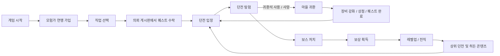

# GamePreProduction
## 1. 시장과 트렌드 분석표
| 항목        | 내용                                   |
| --------- | ------------------------------------ |
| 장르        | 핵앤슬래시 RPG + 로그라이트 + 던전 탐험            |
| 현재 트렌드    | 반복 성장과 파밍 요소가 있는 게임의 인기 지속           |
| 인기 요소     | 랜덤 던전, 장비 파밍, 협동 플레이, 캐릭터 성장         |
| 대표 게임     | Minecraft Dungeons, Hades, Diablo IV |
| 우리 게임 차별점 | 랜덤 던전 + 퀘스트 중심 탐험 + 모험가 연맹 시스템       |
## 2. 타겟 사용자 페르소나

이름 : 이아무개

나이 : 24세

직업 : 대학생 / 취준생

좋아하는 게임
* 로스트아크
* 메이플

게임 성향

* 장비 파밍 좋아함
* 캐릭터 성장 좋아함
-------
이름 : 김누구

나이 : 31세

직업 : 직장인

좋아하는 게임
* 엘든링
* 하데스

게임 성향

* 숨겨진 요소 찾는 걸 좋아함
* 컨트롤로 보스를 깨는 걸 좋아함
## 3.수익모델
| 상품     | 설명      |
| ------ | ------- |
| 캐릭터 스킨 | 의상 판매   |
| 무기 스킨  | 외형 변경   |
| 귀환석    | 편의성 아이템 |
| 탈것     | 이동 외형   |
| 감정표현   | 제스처     |
| 시즌패스   | 미션 보상   |
| DLC       | 새로운 스토리 및 장비 추가 |
## 4.유사 게임 콘텐츠 분석
| 게임                 | 장점    | 참고 요소    |
| ------------------ | ----- | -------- |
| Minecraft Dungeons | 탐험    | 갈림길, 비밀방 |
| Hades              | 반복 성장 | 로그라이트 구조 |
| Diablo IV          | 파밍    | 장비 파밍    |
| Lost Ark           | 전투    | 쿼터뷰 액션 및 보스레이드   |
## 5.게임 아이디어 제안서
### 제목
Chroma Dungeon (가명)
### 장르
쿼터뷰 핵앤슬래시 RPG
### 핵심 컨셉
다양하게 변화하는 던전을 반복적으로 탐험하며 몬스터를 처치하고 퀘스트를 클리어하며 성장하여
던전을 공략하는 RPG
### 주요 특징
* 변화하는 던전과 몬스터
* 다양한 퀘스트
* 직업 / 전직 시스템
* 장비 파밍
* 던전 보스 공략
* 모험가 연맹
### 게임 진행

## 6.세계관 및 시나리오 초안
던전은 계속 변화하며 몬스터를 만들어낸다.

사람들은 던전을 공략해 자원을 얻고 세계를 지킨다.

플레이어는 동부 모험가 연맹 신입 탐험가가 된다.

점점 강력한 던전을 공략하며 세계의 진실을 밝혀간다.
## 7.캐릭터 및 배경 설정
### 플레이어
* 유저들이 플레이하는 캐릭터
* 다양한 직업 선택
### 레아
* 모험가 연맹 동부 지부 접수원
* 항상 활기차고 친절함
* 모험가들에게 직접 퀘스트를 의뢰하거나 연맹 게시판에 여러가지 퀘스트 벽보를 건다
### 레논
* 레아의 친오빠
* 초반 플레이어의 기초교육 담당
* 플레이어 포함 다른 사람들에게는 쌀쌀 맞지만, 여동생에게 만은 친절하다
### 모험가 연맹 동부 지부
* 게임 플레이하며 시작하는 지역(스타팅 지역)
* 여러 등급의 퀘스트들을 모험가들에게 의뢰함
* 모험가들에게 퀘스트 성공 보상 및 등급을 부여함
## 7-1.캐릭터 직업 설정
### 시작 직업
* 전사
* 마법사
* 궁수
* 도적
#### 전사
* 소드 나이트 (검)
* 쉴드 가디언 (검+방패)
* 트윈 슬레이어 (쌍검)
#### 궁수
* 레인저 (장궁 + 무투)
* 헌터 (반궁 + 단검)
* 메카 스피어 (컴뱃보우 + 여러가지 기계 화살)
#### 마법사
* 원소술사 (자연의 힘 + 스태프)
* 마도사 (마도서 + 완드)
* 소환사 (여러 소환수 + 향로)
#### 도적
* 팬텀 (쌍단검 + 은신)
* 베놈 (독 + 클로)
* 섀도우 (표창 + 분신)
## 8.개발 위험&해결 방안
* 직업간 밸런스 문제 -> 테스트를 통한 수치 조정 및 피드백 검토
* 콘텐츠 부족
